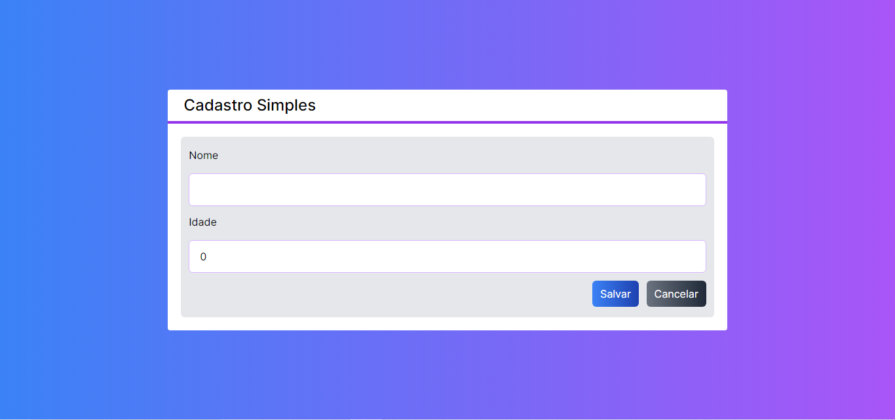

# Cadastro de clientes com NextJs + Firestore

Este é um CRUD de clientes feito no NextJs 14.1.0, que armazena os dados no Firestore da Google.

    

        <b>Lista dos clientes</b>
        
    

    

        <b>Form para novo cliente</b>
        
    

    

        <b>Form para a edição cliente</b>
        
    

## Funcionalidades

Podemos <b>visualizar todos os cliente em uma lista</b>, podemos também <b>criar</b>, <b>editar</b> e <b>excluir</b> os clientes, um clássico CRUD!
